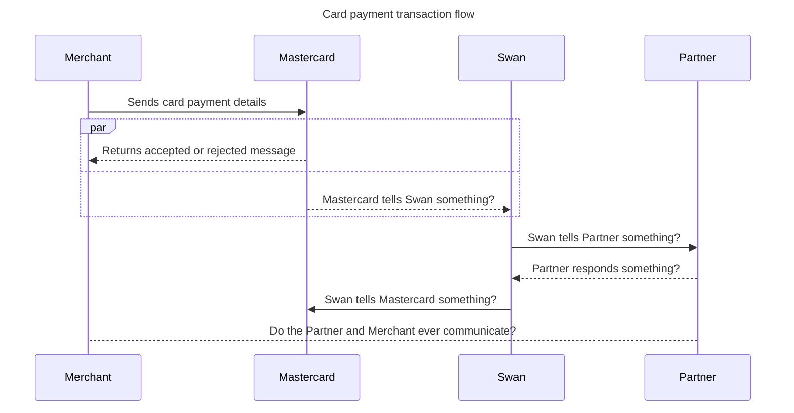

import PartialExample from '../../../_empty.mdx';

# Card payments

## Payment control

Adding payment control gives you partial control over approving and rejecting your users' card payment transactions.

### Partial control

Your control is only partial because partnership with the Mastercard network and the law requires Swan to monitor all card transactions, including approving and rejecting.
Therefore, while Swan has the last word on approving and rejecting a card payment, your preference is considered for payment rejections when you activate payment control.

For example, let's say everything looks good to Swan, but you reject the transaction; we'll tell Mastercard to reject the transaction.
However, if you approve a transaction that Swan rejects, the transaction will be rejected.

### Timeout

Time is sensitive when approving and rejecting payments.
A timeout from Swan results in a rejected operation for your user.